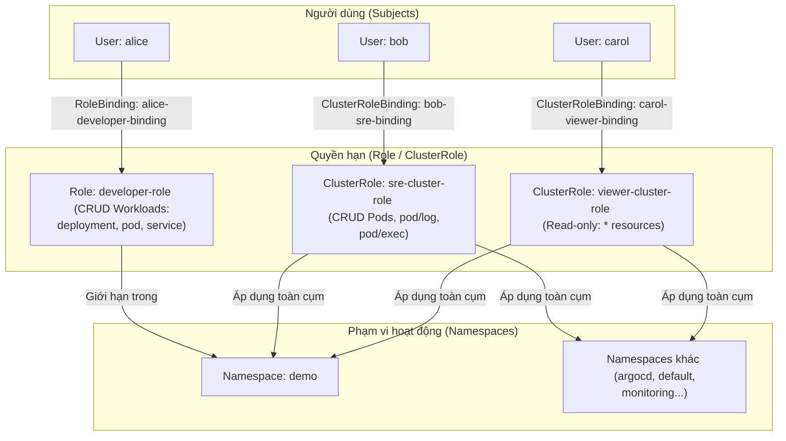

# HƯỚNG DẪN TRIỂN KHAI & NGHIỆM THU: PHÂN QUYỀN RBAC (LAB 1.1)
> **Tài liệu hướng dẫn thiết lập hệ thống Phân quyền dựa trên vai trò (Role-Based Access Control) qua GitOps cho 3 User: Alice (Developer), Bob (SRE), và Carol (Auditor/Viewer).**

---

## 1. TẠI SAO CẦN THỰC HIỆN BƯỚC NÀY?
Mặc định khi khởi tạo cụm Kubernetes, tài khoản người dùng thường có quyền admin cao nhất (`cluster-admin`). Điều này vi phạm nghiêm trọng **Nguyên tắc đặc quyền tối thiểu (Principle of Least Privilege)**. 
* Nếu lập trình viên vô tình xóa nhầm các Pod hệ thống, hệ điều hành cụm sẽ bị sập.
* Do đó, ta cần phân tách trách nhiệm rõ ràng:
  * **Alice (Dev)**: Chỉ thao tác tài nguyên trong namespace phát triển (`demo`).
  * **Bob (SRE)**: Có quyền quản trị Pods (restart/exec/logs) trên toàn cụm để cứu hộ hệ thống nhưng không được thay đổi cấu hình hạ tầng mạng/chính sách.
  * **Carol (Viewer)**: Chỉ được đọc mọi thông tin trên toàn cụm để kiểm toán, không có quyền chỉnh sửa.

---

## 🗺️ 2. SƠ ĐỒ VAI TRÒ VÀ QUYỀN HẠN (RBAC MERMAID)



---

## 📂 3. CẤU HÌNH CHI TIẾT DƯỚI DẠNG GITOPS

### A. Định nghĩa ứng dụng ArgoCD (`argocd/apps/app-rbac.yaml`)
Ứng dụng này khai báo cho ArgoCD biết cần đồng bộ thư mục `rbac/` lên cụm:
```yaml
apiVersion: argoproj.io/v1alpha1
kind: Application
metadata:
  name: app-rbac
  namespace: argocd
  annotations:
    argocd.argoproj.io/sync-wave: "1" # Khởi tạo phân quyền đồng bộ
spec:
  project: default
  source:
    repoURL: 'https://github.com/Hung0codon/Project_Xbrain_W10.git'
    targetRevision: HEAD
    path: rbac
  destination:
    server: 'https://kubernetes.default.svc'
    namespace: demo
  syncPolicy:
    automated:
      prune: true
      selfHeal: true
    syncOptions:
      - CreateNamespace=true
```

### B. Định nghĩa các Role và ClusterRole (`rbac/roles.yaml`)
```yaml
# 1. Quyền developer cho Alice: Chỉ chạy trong namespace demo
apiVersion: rbac.authorization.k8s.io/v1
kind: Role
metadata:
  name: developer-role
  namespace: demo
rules:
- apiGroups: ["", "apps"]
  resources: ["pods", "deployments", "services"]
  verbs: ["get", "list", "watch", "create", "update", "patch", "delete"]
---
# 2. Quyền SRE cho Bob: Có tác dụng Toàn Cụm (ClusterRole) giới hạn với Pods
apiVersion: rbac.authorization.k8s.io/v1
kind: ClusterRole
metadata:
  name: sre-cluster-role
rules:
- apiGroups: [""]
  resources: ["pods", "pods/log", "pods/exec"]
  verbs: ["get", "list", "watch", "create", "update", "patch", "delete"]
---
# 3. Quyền Viewer cho Carol: Xem được mọi tài nguyên trên toàn cụm (Read-only)
apiVersion: rbac.authorization.k8s.io/v1
kind: ClusterRole
metadata:
  name: viewer-cluster-role
rules:
- apiGroups: ["*"]
  resources: ["*"]
  verbs: ["get", "list", "watch"]
```

### C. Gán quyền cho User thông qua Bindings (`rbac/rolebindings.yaml`)
```yaml
# 1. Gắn User alice vào Role developer-role trong namespace demo
apiVersion: rbac.authorization.k8s.io/v1
kind: RoleBinding
metadata:
  name: alice-developer-binding
  namespace: demo
subjects:
- kind: User
  name: alice
  apiGroup: rbac.authorization.k8s.io
roleRef:
  kind: Role
  name: developer-role
  apiGroup: rbac.authorization.k8s.io
---
# 2. Gắn User bob vào ClusterRole sre-cluster-role
apiVersion: rbac.authorization.k8s.io/v1
kind: ClusterRoleBinding
metadata:
  name: bob-sre-binding
subjects:
- kind: User
  name: bob
  apiGroup: rbac.authorization.k8s.io
roleRef:
  kind: ClusterRole
  name: sre-cluster-role
  apiGroup: rbac.authorization.k8s.io
---
# 3. Gắn User carol vào ClusterRole viewer-cluster-role
apiVersion: rbac.authorization.k8s.io/v1
kind: ClusterRoleBinding
metadata:
  name: carol-viewer-binding
subjects:
- kind: User
  name: carol
  apiGroup: rbac.authorization.k8s.io
roleRef:
  kind: ClusterRole
  name: viewer-cluster-role
  apiGroup: rbac.authorization.k8s.io
```

---

## 🧪 4. KỊCH BẢN KIỂM THỬ VÀ NGHIỆM THU (TEST SCRIPT)

Sử dụng lệnh kiểm thử phân quyền tích hợp `kubectl auth can-i` để đóng vai (impersonate) từng User:

### 🔬 Kiểm thử 1: Xác nhận quyền của Alice (Developer)
* **Lệnh 1**: Kiểm tra tạo deployment trong namespace `demo`:
  ```bash
  kubectl auth can-i create deployment -n demo --as=alice
  ```
  *Kết quả kỳ vọng*: `yes`
* **Lệnh 2**: Kiểm tra tạo deployment trong namespace `default` (ngoài vùng quản lý):
  ```bash
  kubectl auth can-i create deployment -n default --as=alice
  ```
  *Kết quả kỳ vọng*: `no`

### 🔬 Kiểm thử 2: Xác nhận quyền của Bob (SRE)
* **Lệnh 1**: Kiểm tra xóa Pod bất kỳ ở namespace `kube-system` (toàn cụm):
  ```bash
  kubectl auth can-i delete pod -n kube-system --as=bob
  ```
  *Kết quả kỳ vọng*: `yes`
* **Lệnh 2**: Kiểm tra tạo deployment mới trên cụm:
  ```bash
  kubectl auth can-i create deployment -n demo --as=bob
  ```
  *Kết quả kỳ vọng*: `no` (Bob chỉ được quản lý Pods).

### 🔬 Kiểm thử 3: Xác nhận quyền của Carol (Viewer)
* **Lệnh 1**: Kiểm tra xem danh sách Deployment trên toàn cụm:
  ```bash
  kubectl auth can-i get deployments -A --as=carol
  ```
  *Kết quả kỳ vọng*: `yes`
* **Lệnh 2**: Kiểm tra chỉnh sửa/xóa tài nguyên bất kỳ:
  ```bash
  kubectl auth can-i delete pod -n demo --as=carol
  ```
  *Kết quả kỳ vọng*: `no` (Carol chỉ được đọc thông tin).
