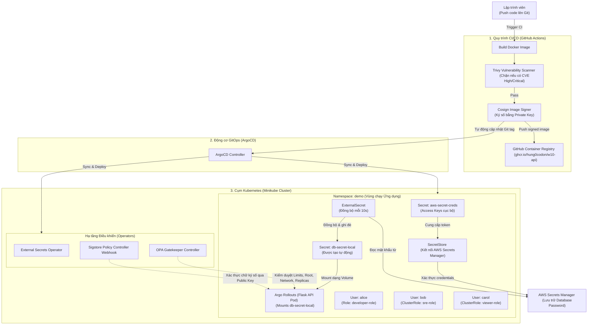

# TÀI LIỆU TOÀN DIỆN: BẢN THIẾT KẾ KIẾN TRÚC & PHÂN TÍCH CODE CHO TOÀN BỘ DỰ ÁN W10
> **Tài liệu phân tích chuyên sâu mã nguồn (Code Plan) của toàn bộ hệ thống DevSecOps dự án W10: Quản lý phân quyền (RBAC), kiểm soát chính sách (OPA Gatekeeper), bảo mật bí mật (External Secrets Operator - ESO), chuyển giao cấp tiến (Argo Rollouts Canary) và bảo mật chuỗi cung ứng (Trivy + Cosign).**

---

## 🗺️ 1. SƠ ĐỒ TOÀN CẢNH KIẾN TRÚC HỆ THỐNG (SYSTEM OVERVIEW)



---

## 🛠️ 2. PHÂN TÍCH CHI TIẾT TỪNG PHẦN (LAB-BY-LAB CODE ANALYSIS)

### PHẦN 1: HỆ THỐNG PHÂN QUYỀN RBAC (LAB 1.1)
Mục tiêu là cấu hình đặc quyền tối thiểu cho 3 người dùng: Alice (Developer), Bob (SRE), và Carol (Viewer) mà không chạy lệnh apply tay.

#### A. File Cấu hình Vai trò: `rbac/roles.yaml`
```yaml
# 1. Quyền developer cho alice : chỉ chạy trong namespace demo
apiVersion: rbac.authorization.k8s.io/v1
kind: Role
metadata:
  name: developer-role
  namespace: demo
rules:
- apiGroups: ["", "apps"]
  resources: ["pods", "deployments", "services"]
  verbs: ["get", "list", "watch", "create", "update", "patch", "delete"]
---
# 2. Quyền SRE cho Bob: Có tác dụng Toàn Cụm (ClusterRole) nhưng chỉ giới hạn với Pods
apiVersion: rbac.authorization.k8s.io/v1
kind: ClusterRole
metadata:
  name: sre-cluster-role
rules:
- apiGroups: [""]
  resources: ["pods", "pods/log", "pods/exec"]
  verbs: ["get", "list", "watch", "create", "update", "patch", "delete"]
---
# 3. Quyền Viewer cho Carol: Xem được mọi tài nguyên trên toàn cụm nhưng không được sửa/xóa
apiVersion: rbac.authorization.k8s.io/v1
kind: ClusterRole
metadata:
  name: viewer-cluster-role
rules:
- apiGroups: ["*"]
  resources: ["*"]
  verbs: ["get", "list", "watch"]
```
##### 🔍 Phân tích chi tiết:
* **`developer-role`**: Sử dụng resource `Role` có tính cục bộ trong namespace `demo`. Cung cấp toàn bộ các hành động đọc/ghi (`create`, `update`, `delete`, v.v.) đối với `pods`, `deployments` và `services`.
* **`sre-cluster-role`**: Sử dụng `ClusterRole` (toàn cụm) để Bob có thể xử lý sự cố ở bất kỳ namespace nào. Tuy nhiên chỉ giới hạn đối tượng tài nguyên là `pods` và hai sub-resources quan trọng là `pods/log` (xem log) và `pods/exec` (chui vào container gỡ lỗi).
* **`viewer-cluster-role`**: Carol được quyền đọc toàn bộ tài nguyên trên cluster (`resources: ["*"]` và `apiGroups: ["*"]`) nhưng bị giới hạn chặt chẽ ở các động từ đọc dữ liệu (`get`, `list`, `watch`), chặn đứng nguy cơ phá hỏng hệ thống.

#### B. File Gán quyền: `rbac/rolebindings.yaml`
```yaml
# 1. Gắn User alice vào Role developer-role trong namespace demo
apiVersion: rbac.authorization.k8s.io/v1
kind: RoleBinding
metadata:
  name: alice-developer-binding
  namespace: demo
subjects:
- kind: User
  name: alice
  apiGroup: rbac.authorization.k8s.io
roleRef:
  kind: Role
  name: developer-role
  apiGroup: rbac.authorization.k8s.io
---
# 2. Gắn User bob vào ClusterRole sre-cluster-role
apiVersion: rbac.authorization.k8s.io/v1
kind: ClusterRoleBinding
metadata:
  name: bob-sre-binding
subjects:
- kind: User
  name: bob
  apiGroup: rbac.authorization.k8s.io
roleRef:
  kind: ClusterRole
  name: sre-cluster-role
  apiGroup: rbac.authorization.k8s.io
---
# 3. Gắn User carol vào ClusterRole viewer-cluster-role
apiVersion: rbac.authorization.k8s.io/v1
kind: ClusterRoleBinding
metadata:
  name: carol-viewer-binding
subjects:
- kind: User
  name: carol
  apiGroup: rbac.authorization.k8s.io
roleRef:
  kind: ClusterRole
  name: viewer-cluster-role
  apiGroup: rbac.authorization.k8s.io
```
##### 🔍 Phân tích chi tiết:
* `alice-developer-binding` sử dụng `RoleBinding` định nghĩa trong namespace `demo` kết nối tài khoản người dùng `alice` vào `developer-role`. Quyền lực của Alice bị cô lập hoàn toàn tại đây.
* `bob-sre-binding` và `carol-viewer-binding` sử dụng `ClusterRoleBinding` cấp cụm (không khai báo trường `namespace`). Kết nối hai tài khoản tương ứng với các ClusterRole để áp dụng quyền lực toàn cục.

---

### PHẦN 2: KIỂM SOÁT CHÍNH SÁCH MANIFEST - OPA GATEKEEPER (LAB 1.2 & 1.3)
Sử dụng OPA Gatekeeper nhằm lọc cấu hình xấu. Luật quan trọng nhất là giới hạn replicas <= 5 (Custom template).

#### A. File Custom ConstraintTemplate: `gatekeeper/templates/k8smaxreplicas.yaml`
```yaml
apiVersion: templates.gatekeeper.sh/v1
kind: ConstraintTemplate
metadata:
  name: k8smaxreplicas
spec:
  crd:
    spec:
      names:
        kind: K8sMaxReplicas
      validation:
        openAPIV3Schema:
          type: object
          properties:
            maxReplicas:
              type: integer
  targets:
    - target: admission.k8s.gatekeeper.sh
      rego: |
        package k8smaxreplicas

        violation[{"msg": msg}] {
          replicas := input.review.object.spec.replicas
          max_allowed := input.parameters.maxReplicas
          replicas > max_allowed
          msg := sprintf("Số lượng bản sao (%v) vượt quá mức tối đa cho phép (%v) của hệ thống!", [replicas, max_allowed])
        }
```
##### 🔍 Phân tích chi tiết mã nguồn Rego:
* `input.review.object.spec.replicas`: Lấy giá trị cấu hình số lượng Pod chạy thực tế trong file Deployment hoặc Rollout gửi lên.
* `input.parameters.maxReplicas`: Lấy số lượng tối đa cấu hình ở lớp ngoài (Constraint).
* `replicas > max_allowed`: Điều kiện xảy ra vi phạm. Nếu thỏa mãn, Gatekeeper lập tức trả về lỗi.
* `sprintf(...)`: Định hình thông báo lỗi chi tiết hiển thị trực tiếp lên màn hình lập trình viên.

#### B. File Constraint Áp dụng Luật: `gatekeeper/constraints/max-replicas-5.yaml`
```yaml
apiVersion: constraints.gatekeeper.sh/v1beta1
kind: K8sMaxReplicas
metadata:
  name: limit-deployment-replicas
spec:
  enforcementAction: deny
  match:
    kinds:
      - apiGroups: ["apps"]
        kinds: ["Deployment"]
    namespaces:
      - demo
  parameters:
    maxReplicas: 5
```
##### 🔍 Phân tích chi tiết:
* `kind: K8sMaxReplicas`: Khai báo sử dụng bộ khung phân tích đã dựng sẵn từ ConstraintTemplate.
* `enforcementAction: deny`: Chặn đứng ngay lập tức (không cho ghi vào database etcd).
* `match.namespaces: ["demo"]`: **Gỡ bẫy thiết kế**. Giới hạn OPA chỉ quét namespace `demo`. Tránh quét các namespace hệ thống dẫn tới treo cụm ArgoCD do các pod nền bị chặn.
* `parameters.maxReplicas: 5`: Tham số động truyền vào Rego engine để làm mốc so sánh.

---

### PHẦN 3: TỰ ĐỘNG ĐỒNG BỘ MẬT KHẨU - EXTERNAL SECRETS OPERATOR (LAB 2.1)
Mục tiêu là kết nối AWS Secrets Manager, đồng bộ mật khẩu tự động dưới 60s và nạp vào Pod Flask API dạng Volume Mount để có thể tự động cập nhật mà không cần restart container.

#### A. File Cấu hình SecretStore: `eso/secret-store.yaml`
```yaml
apiVersion: external-secrets.io/v1beta1
kind: SecretStore
metadata:
  name: aws-secret-store
  namespace: demo
spec:
  provider:
    aws:
      service: SecretsManager
      region: ap-southeast-1
      auth:
        secretRef:
          accessKeyIdSecretRef:
            name: aws-secret-creds
            key: access-key-id
          secretAccessKeySecretRef:
            name: aws-secret-creds
            key: secret-access-key
```
##### 🔍 Phân tích chi tiết:
* `provider.aws`: Chỉ định kết nối tới dịch vụ quản lý mật khẩu AWS Secrets Manager đặt tại máy chủ Singapore (`ap-southeast-1`).
* `auth.secretRef`: Chỉ đường dẫn lấy thông tin API Keys kết nối AWS từ một K8s Secret cục bộ tên là `aws-secret-creds`. Tránh việc lưu trữ cứng thông tin tài khoản đám mây lên Git.

#### B. File Yêu cầu Đồng bộ Mật khẩu: `eso/external-secret.yaml`
```yaml
apiVersion: external-secrets.io/v1beta1
kind: ExternalSecret
metadata:
  name: db-secret-sync
  namespace: demo
spec:
  refreshInterval: 10s # Đồng bộ mỗi 10 giây
  secretStoreRef:
    name: aws-secret-store
    kind: SecretStore
  target:
    name: db-secret-local # K8s Secret tự động tạo ra trong cụm
    creationPolicy: Owner
  data:
    - secretKey: local_db_password
      remoteRef:
        key: prod/db/credentials
        property: db_password
```
##### 🔍 Phân tích chi tiết:
* `refreshInterval: 10s`: **Đạt tiêu chí đồng bộ < 60 giây**. Cứ mỗi 10 giây, Operator sẽ chủ động gọi API sang AWS để kiểm tra xem mật khẩu có thay đổi hay không.
* `target.name: db-secret-local`: Tên của K8s Secret mà Operator tự sinh ra bên trong namespace `demo` chứa mật khẩu thực tế sau khi giải mã base64.
* `data.remoteRef`: Ánh xạ khóa `db_password` lưu trữ trên đám mây vào khóa `local_db_password` ở cụm Kubernetes cục bộ.

#### C. Volume Mount trong Deployment/Rollout: `app-api/rollout.yaml` (Trích đoạn)
```yaml
spec:
  template:
    spec:
      containers:
      - name: api
        image: ghcr.io/hung0codon/w10-api:0.0.3
        volumeMounts:
        - name: db-secret-vol
          mountPath: /etc/secrets
          readOnly: true
      volumes:
      - name: db-secret-vol
        secret:
          secretName: db-secret-local
          items:
          - key: local_db_password
            path: local_db_password
```
##### 🔍 Phân tích chi tiết (Zero-Downtime Secret Rotation):
* Khác với việc nạp mật khẩu thông qua biến môi trường (`env` - yêu cầu restart Pod mới nhận giá trị mới), việc gắn mật khẩu dưới dạng **Volume Mount** (`/etc/secrets/local_db_password`) tận dụng cơ chế đồng bộ tự động của Kubelet.
* Khi ESO cập nhật mật khẩu mới vào `db-secret-local`, Kubelet sẽ tự động cập nhật nội dung file tĩnh bên trong Container sau vài giây. Tiến trình Flask API chỉ cần đọc trực tiếp từ file này mà không cần khởi động lại container (No restarts), giữ kết nối liên tục không gián đoạn.

---

### PHẦN 4: BẢO MẬT CHUỖI CUNG ỨNG - TRIVY & COSIGN (LAB 2.2)
Tích hợp quét lỗ hổng Trivy và ký số Cosign tại pipeline, triển khai Sigstore Admission Controller để kiểm duyệt chữ ký trên cụm K8s.

#### A. File Cấu hình Pipeline GitHub Actions: `.github/workflows/build-push.yml` (Trích đoạn)
```yaml
      # 1. Quét lỗ hổng bảo mật bằng Trivy
      - name: Run Trivy vulnerability scanner
        uses: aquasecurity/trivy-action@v0.35.0
        with:
          image-ref: '${{ env.REGISTRY }}/${{ env.IMAGE_NAME }}:${{ steps.semver.outputs.version }}'
          format: 'table'
          exit-code: '1' # Báo lỗi và dừng pipeline nếu phát hiện CVE High/Critical
          ignore-unfixed: true # Bỏ qua các lỗi chưa có bản vá từ nhà cung cấp (Exception ADR)
          vuln-type: 'os,library'
          severity: 'CRITICAL,HIGH'
        env:
          TRIVY_USERNAME: ${{ github.actor }}
          TRIVY_PASSWORD: ${{ secrets.GITHUB_TOKEN }}

      # 2. Cài đặt môi trường Cosign
      - name: Install Cosign
        uses: sigstore/cosign-installer@v3.5.0

      # 3. Ký tên lên Docker Image
      - name: Sign published Docker image
        env:
          COSIGN_PRIVATE_KEY: ${{ secrets.COSIGN_PRIVATE_KEY }}
          COSIGN_PASSWORD: ${{ secrets.COSIGN_PASSWORD }}
        run: |
          cosign sign --yes --key env://COSIGN_PRIVATE_KEY "${{ env.REGISTRY }}/${{ env.IMAGE_NAME }}:${{ steps.semver.outputs.version }}"
```
##### 🔍 Phân tích chi tiết:
* **Trivy Scanner (`exit-code: '1'`)**: Đạt tiêu chí **CI đỏ khi có CVE HIGH/CRITICAL**. Nếu phát hiện thư viện dính lỗi bảo mật nghiêm trọng, pipeline sẽ dừng lại ngay lập tức, chặn đứng quy trình ký số phía sau.
* **`ignore-unfixed: true`**: Hiện thực hóa quyết định cấu trúc ngoại lệ có thời hạn (Exception ADR), tránh việc dự án bị kẹt vô thời hạn do các lỗi của nền tảng chưa được vá từ thượng nguồn.
* **Cosign Sign**: Sử dụng khóa bí mật cấu hình trên GitHub Secret để ký xác thực lên thẻ định danh (tag) của image, đảm bảo tính chống giả mạo tuyệt đối.

#### B. Chính sách xác thực chữ ký số trên K8s: `policies/cluster-image-policy.yaml`
```yaml
apiVersion: policy.sigstore.dev/v1alpha1
kind: ClusterImagePolicy
metadata:
  name: image-signature-policy
spec:
  images:
    - glob: "ghcr.io/hung0codon/*" # Chỉ áp dụng kiểm tra đối với registry của bạn
  authorities:
    - key:
        data: |
          -----BEGIN PUBLIC KEY-----
          MFkwEwYHKoZIzj0CAQYIKoZIzj0DAQcDQgAEk/BAyGGecagdjSgJc5y2QngfadSl
          aXsy0wNT1WDUTWtnQbNmFkbW0fIWDUxoVXnGJWuetRPJX8f2pkkeY731dQ==
          -----END PUBLIC KEY-----
```
##### 🔍 Phân tích chi tiết:
* `glob: "ghcr.io/hung0codon/*"`: Giới hạn bộ quét chữ ký số của Sigstore chỉ tập trung kiểm soát các container do chính bạn đẩy lên.
* `key.data`: Chứa nội dung Public Key của bạn (`cosign.pub`). Khi có yêu cầu chạy container, Webhook Sigstore sẽ giải mã chữ ký đi kèm image bằng Public Key này. Nếu chữ ký không trùng khớp hoặc không tồn tại (chưa được ký), yêu cầu khởi tạo Pod sẽ bị chặn ngay tại API Server (Admission Reject).
