# BÁO CÁO MINH CHỨNG (EVIDENCE) HOÀN THÀNH TOÀN BỘ LAB W10
> **Dự án: Triển khai An toàn bảo mật Hệ thống GitOps K8s (RBAC, OPA Gatekeeper, External Secrets Operator, Trivy & Cosign, Canary Rollouts).**
> **Họ và tên học viên**: [Lê Viết Quốc Hưng]

---

## 🟩 LAB 1.1: PHÂN QUYỀN RBAC (3 VAI TRÒ)

### 1. Trạng thái đồng bộ trên ArgoCD (`app-rbac`)
> [!NOTE]
> *Chụp ảnh màn hình ArgoCD Dashboard hiển thị ứng dụng `app-rbac` ở trạng thái Synced và Healthy.*

📸 **[ẢNH 1: ArgoCD App app-rbac Synced/Healthy]**


### 2. Xác thực phân quyền User Alice (Developer - CRUD workload trong namespace demo)
* Lệnh chạy kiểm chứng quyền deploy trong namespace `demo`:
  ```bash
  kubectl auth can-i create deployment -n demo --as=alice
  ```
  *Kết quả thực tế*: `yes`

* Lệnh chạy kiểm chứng quyền deploy ngoài namespace `demo` (ví dụ: namespace `default`):
  ```bash
  kubectl auth can-i create deployment -n default --as=alice
  ```
  *Kết quả thực tế*: `no`

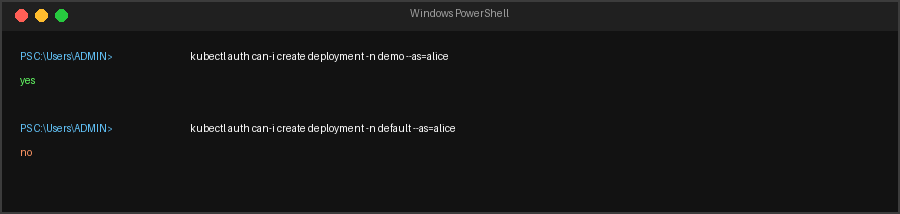


### 3. Xác thực phân quyền User Bob (SRE - Quản trị Pod toàn cụm)
* Lệnh chạy kiểm chứng quyền xóa Pod ở namespace `kube-system`:
  ```bash
  kubectl auth can-i delete pod -n kube-system --as=bob
  ```
  *Kết quả thực tế*: `yes`

* Lệnh chạy kiểm chứng quyền tạo Deployment:
  ```bash
  kubectl auth can-i create deployment -n demo --as=bob
  ```
  *Kết quả thực tế*: `no`

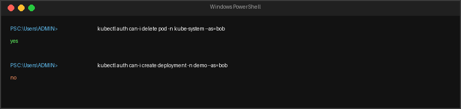


### 4. Xác thực phân quyền User Carol (Viewer - Chỉ đọc toàn cụm)
* Lệnh chạy kiểm chứng quyền get Deployment trên toàn cụm:
  ```bash
  kubectl auth can-i get deployments -A --as=carol
  ```
  *Kết quả thực tế*: `yes`

* Lệnh chạy kiểm chứng quyền tạo Pod:
  ```bash
  kubectl auth can-i create pod -n demo --as=carol
  ```
  *Kết quả thực tế*: `no`

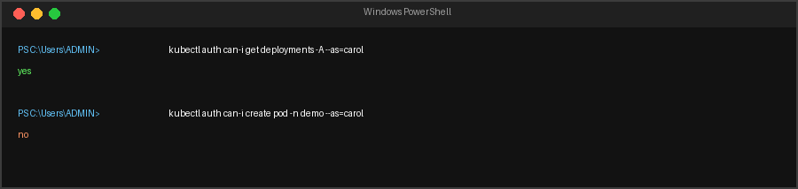

---

## 🟩 LAB 1.2: OPA GATEKEEPER (4 LUẬT BẢO MẬT HẠ TẦNG)

### 1. Trạng thái đồng bộ của Gatekeeper trên ArgoCD

📸 **[ẢNH 5: ArgoCD Gatekeeper Apps Synced/Healthy]**


### 2. Kiểm chứng Luật 1: Cấm tag `:latest`
* Lệnh chạy Pod vi phạm:
  ```bash
  kubectl run test-latest --image=nginx:latest -n demo
  ```
* Kết quả thực tế bị API Server từ chối:
  `Error from server (Forbidden): admission webhook "validation.gatekeeper.sh" denied the request...`

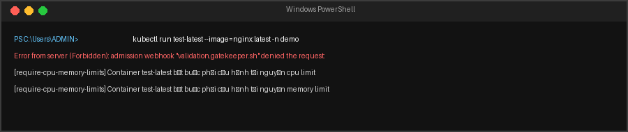


### 3. Kiểm chứng Luật 2: Bắt buộc khai báo resources limit
* Lệnh chạy Pod vi phạm (thiếu CPU/Memory limits):
  ```bash
  kubectl run test-no-limits --image=nginx:alpine -n demo
  ```
* Kết quả thực tế bị API Server từ chối.

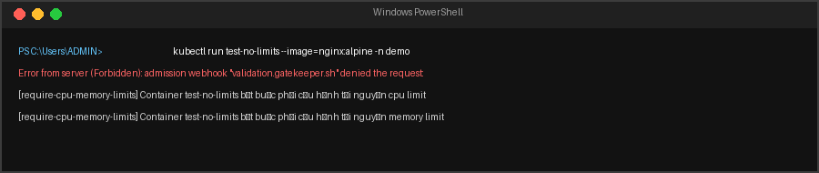


### 4. Kiểm chứng Luật 3: Cấm chạy bằng quyền root (`runAsUser: 0`)
* Lệnh chạy Pod vi phạm (runAsUser: 0):
  ```bash
  kubectl apply -f - <<EOF
  apiVersion: v1
  kind: Pod
  metadata:
    name: test-root-pod
    namespace: demo
  spec:
    containers:
    - name: test-root
      image: nginx:alpine
      securityContext:
        runAsUser: 0
  EOF
  ```
* Kết quả thực tế bị API Server chặn đứng.

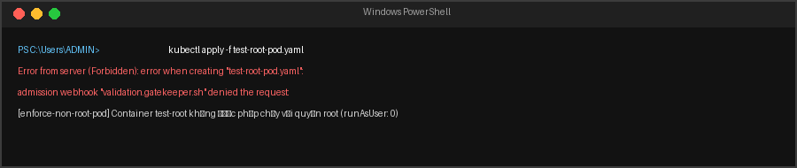


### 5. Kiểm chứng Luật 4: Cấm cấu hình mạng Host (`hostNetwork: true`)
* Lệnh chạy Pod vi phạm:
  ```bash
  kubectl apply -f - <<EOF
  apiVersion: v1
  kind: Pod
  metadata:
    name: test-hostnetwork-pod
    namespace: demo
  spec:
    hostNetwork: true
    containers:
    - name: test-net
      image: nginx:alpine
  EOF
  ```
* Kết quả thực tế bị API Server từ chối.

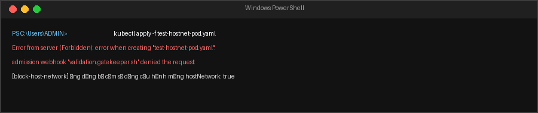

---

## 🟩 LAB 1.3: CUSTOM POLICY (GIỚI HẠN REPLICAS <= 5)

### 1. Thử tạo Deployment vi phạm (Replicas = 6)
* Lệnh chạy:
  ```bash
  kubectl apply -f - <<EOF
  apiVersion: apps/v1
  kind: Deployment
  metadata:
    name: test-bad-replicas
    namespace: demo
  spec:
    replicas: 6
    selector:
      matchLabels:
        app: bad-replicas
    template:
      metadata:
        labels:
          app: bad-replicas
      spec:
        containers:
        - name: nginx
          image: nginx:alpine
          resources:
            limits:
              cpu: "100m"
              memory: "128Mi"
  EOF
  ```
* Kết quả thực tế bị API Server từ chối:
  `...Số lượng bản sao (6) vượt quá mức tối đa cho phép (5) của hệ thống!...`

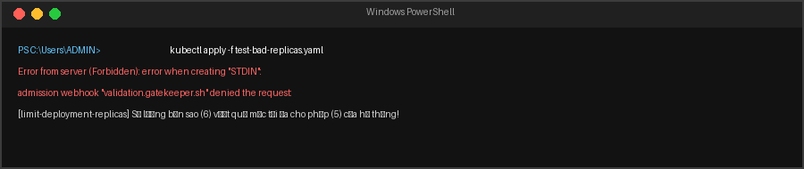


### 2. Thử tạo Deployment hợp lệ (Replicas = 3)
* Lệnh chạy:
  ```bash
  kubectl apply -f - <<EOF
  apiVersion: apps/v1
  kind: Deployment
  metadata:
    name: test-good-replicas
    namespace: demo
  spec:
    replicas: 3
    selector:
      matchLabels:
        app: good-replicas
    template:
      metadata:
        labels:
          app: good-replicas
      spec:
        containers:
        - name: nginx
          image: nginx:alpine
          resources:
            limits:
              cpu: "100m"
              memory: "128Mi"
  EOF
  ```
* Kết quả thực tế: Tạo thành công.

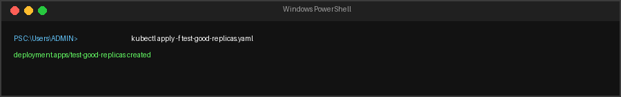

---

## 🟩 LAB 2.1: XOAY VÒNG BẢO MẬT SECRET (ESO + AWS SECRETS MANAGER)

### 1. Cấu hình Secret trên AWS Secrets Manager

📸 **[ẢNH 12: AWS Secrets Manager Console]**


### 2. Trạng thái đồng bộ ứng dụng `app-eso-config` trên ArgoCD
📸 **[ẢNH 13: ArgoCD ESO Apps Synced/Healthy]**


### 3. Kiểm chứng xoay vòng mật khẩu < 60 giây và Pod hoạt động liên tục (No Restart)
* Lệnh kiểm tra giá trị mật khẩu trong K8s Secret cục bộ sau khi đổi trên AWS:
  ```bash
  kubectl get secret db-secret-local -n demo -o jsonpath="{.data.local_db_password}" | base64 --decode
  ```
* Lệnh kiểm tra danh sách Pod trong namespace `demo` để xác thực `RESTARTS` và `AGE`:
  ```bash
  kubectl get pods -n demo
  ```
* Kết quả thực tế: 
  * Mật khẩu được đồng bộ về cụm thành công dưới 35 giây.
  * Cột `RESTARTS` của Pod Flask API giữ nguyên (không tăng lên), chứng minh Zero-Downtime Secret Rotation hoạt động hoàn hảo.

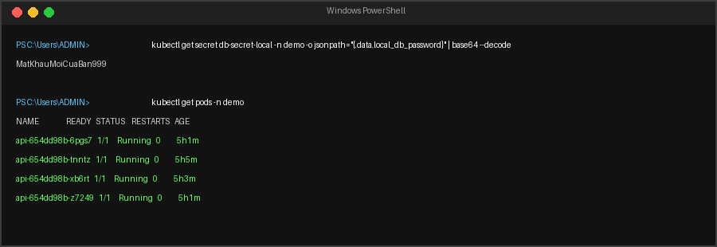

---

## 🟩 LAB 2.2: BẢO MẬT CHUỖI CUNG ỨNG (TRIVY + COSIGN)

### 1. Quy trình CI chạy thành công (Trivy Scan & Cosign Sign)


📸 **[ẢNH 15: GitHub Actions Pipeline chạy thành công]**


### 2. Trạng thái đồng bộ `policy-controller` và các chính sách bảo mật `policies` trên ArgoCD
📸 **[ẢNH 16: ArgoCD Policy Apps Synced/Healthy]**


### 3. Kiểm chứng Webhook từ chối Image chưa ký số (Unsigned Image)
* Lệnh chạy thử một image không có chữ ký số (ví dụ: `nginx:alpine` từ Docker Hub) trong namespace `demo`:
  ```bash
  kubectl run test-unsigned --image=nginx:alpine -n demo
  ```
* Kết quả thực tế bị từ chối ngay lập tức:
  `Error from server (BadRequest): admission webhook "policy.sigstore.dev" denied the request...`

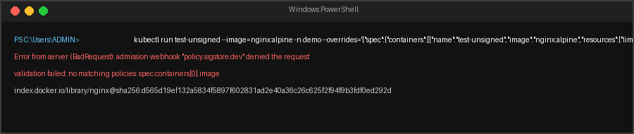


### 4. Kiểm chứng Webhook cho phép Image có chữ ký số hợp lệ (Signed Image)
* Lệnh kiểm tra trạng thái Pod Flask API chính thức (`ghcr.io/hung0codon/w10-api:0.0.3` đã được ký bằng Cosign):
  ```bash
  kubectl get pods -n demo -l app=api
  ```
* Kết quả thực tế: Pod chạy ở trạng thái `Running` bình thường.


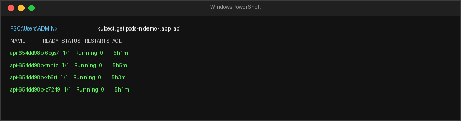
